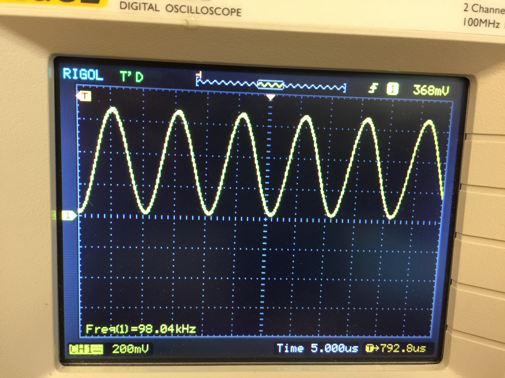
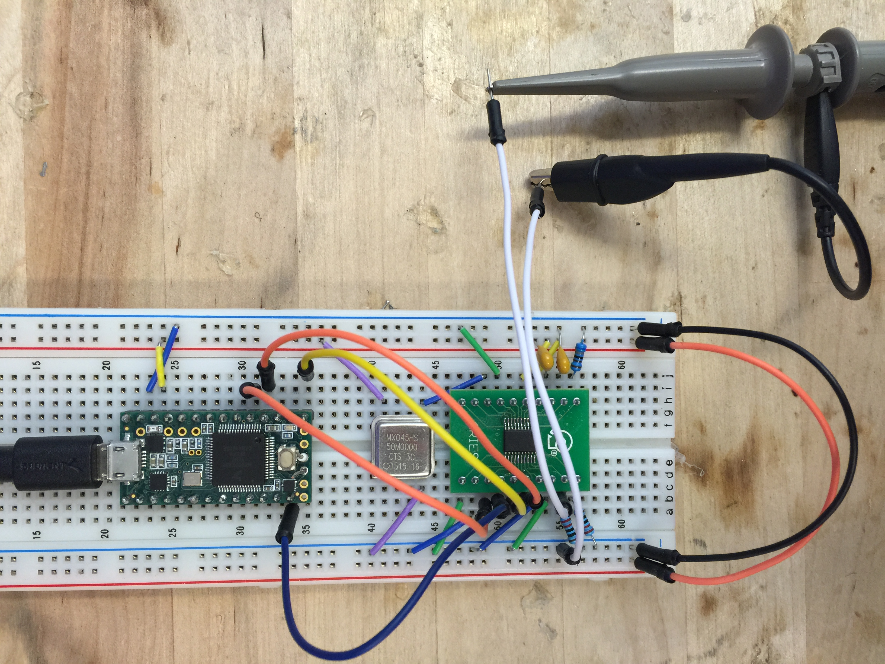
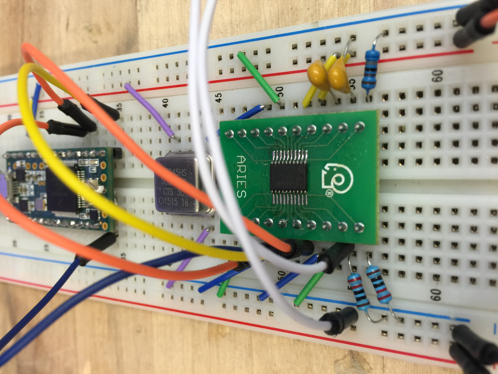

# Teensy3.2_Config_AD5930
Teensy3.2 (32 bit ARM Cortex-M4) configs AD5930 to output 100KHz sine wave

AD5930 is compatible with 3.3V logic SOC, which compares favorable than AD9835 (5V logic) in our project. However, I found little tutorial online for configuring AD5930, specially the arduino-style examples and code. I made this tutorial, hoping to help people setting up the pipeline more easily.

Teensy 3.2 can be found here:
https://www.pjrc.com/store/teensy32.html

The datasheet of the AD5930 can be found here: 
http://www.analog.com/media/en/technical-documentation/data-sheets/AD5930.pdf

Many useful discussions can be found here: 
https://ez.analog.com/search.jspa?q=AD5930

Here is the 100KHz sine wave shown on the oscilloscope:

Wiring between the teensy and the AD5930 chip. Sorry for any confusion. Will upload schematics when I get time.

